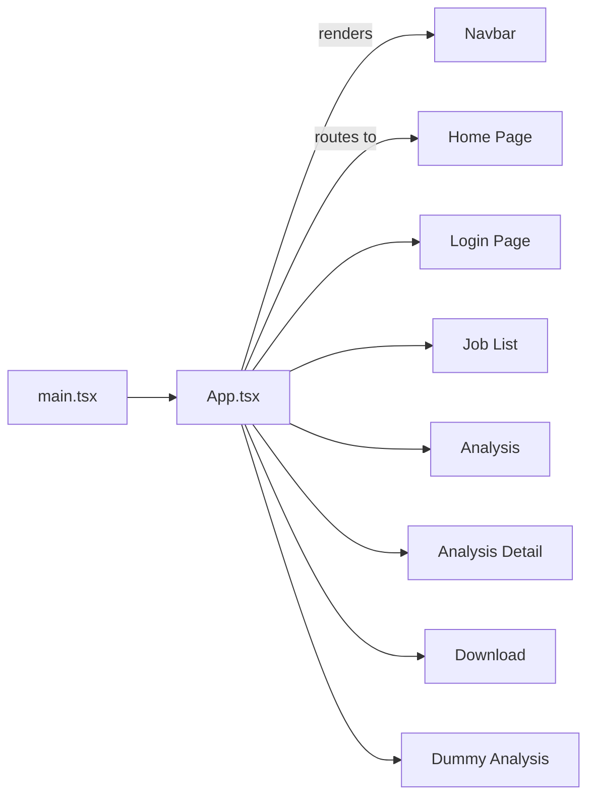

# 📄 JD Analyzer Frontend Documentation

Welcome to the **JD Analyzer** frontend! This document provides an in-depth overview of the selected files in the repository, explaining their purpose, key logic, and relationships. Use the **Index** below to navigate.

---

## 📑 Index

1. [Overview & Architecture](#-overview--architecture)
2. [Setup & Configuration](#-setup--configuration)
3. [Entry Points](#-entry-points)
4. [Components](#-components)
   - [Navbar](#navbar)
   - [LoginPrompt](#loginprompt)
5. [Custom Hooks](#custom-hooks)
   - [useAuth](#useauth)
   - [useNavigation](#usenavigation)
6. [Pages](#pages)
   - [Home](#home)
   - [Login](#login)
   - [Job List](#job-list)
   - [Analysis](#analysis)
   - [AnalysisDetail](#analysisdetail)
   - [Download](#download)
   - [DummyAnalysis](#dummyanalysis)
7. [State Management](#state-management)
8. [API & Storage Utilities](#api--storage-utilities)
9. [Mocking (MSW)](#mocking-msw)
10. [Testing Utilities & Suites](#testing-utilities--suites)
11. [Type Definitions](#type-definitions)
12. [Build & Tooling](#build--tooling)

---

## 📈 Overview & Architecture

At a high level, **main.tsx** bootstraps the React app:



- **React Router** handles client-side routing.
- **Redux Toolkit** manages analysis data in `resultSlice`.
- **MSW** (Mock Service Worker) intercepts API calls in both browser (`mocks/browser.ts`) and Node (`mocks/server.ts`) for tests.
- **Vitest** & **Testing Library** power unit and integration tests.

---

## ⚙️ Setup & Configuration

1. **Dependencies**: React, React Router v7, Redux Toolkit, Bootstrap, html2pdf.js, axios, msw, react-toastify, Vitest, ESLint, TypeScript, Vite.
2. **Environment**: No external `.env`—API base URLs are hard-coded for mocking.
3. **Dev Scripts**:
   - `npm run dev` – starts Vite dev server.
   - `npm run build` – bundles for production.
   - `npm test` – runs Vitest in terminal.
   - `npm run test:ui` – opens Vitest UI.
4. **Dockerfile**: Builds a multi-stage image for containerized deployment.

---

## 🚀 Entry Points

### src/main.tsx

- Wraps `<App/>` with Redux `<Provider>` and React Router `<BrowserRouter>`.
- Injects global CSS (Bootstrap, react-toastify, custom).

### src/App.tsx

- Conditionally renders `Navbar` (hidden on `/login`).
- Defines routes:
  - `/` → `<Home/>`
  - `/login` → `<Login/>`
  - `/jds` → `<Joblist/>`
  - `/analysis` → `<Analysis/>`
  - `/analysis/:id` → `<AnalysisDetail/>`
  - `/download` → `<Download/>`
  - `/dummy` → `<DummyAnalysis/>`

---

## 🧩 Components

### Navbar

**Path**: `src/components/Navbar.tsx`  
**Purpose**: Top navigation bar showing brand, login/logout, user avatar, loading spinner.

- **Hooks used**: `useAuth`, `useNavigation`.
- **States**:
  - `isLoading` → shows spinner.
  - `userEmail` → toggles between Login button or user menu.
- **Accessibility**: Keyboard‐accessible brand (Enter/Space triggers navigation).
- **Styling**: Bootstrap + custom CSS.

#### Navbar Test

**Path**: `src/components/__tests__/Navbar.test.tsx`  
Validates:
- Bootstrap classes, brand styling.
- Logged‐in vs logged‐out UI.
- Avatar initial logic.
- Logout functionality calls `useAuth.logout`.
- Accessibility roles and focus.

---

### LoginPrompt

**Path**: `src/components/LoginPrompt.tsx`  
**Purpose**: Modal overlay prompting unauthenticated users to log in before analyzing.

- **Props**: `onClose: () => void`.
- **Actions**:
  - Clicking outside or “Cancel” closes modal.
  - “Go to Login” navigates to `/login`.
- **Styling**: Custom CSS in `LoginPrompt.css`.

#### LoginPrompt Test

**Path**: `src/components/__tests__/LoginPrompt.test.tsx`  
Covers:
- Rendering title, message, buttons.
- `onClose` callback.
- Navigation to login on Go-to-Login click.

---

## 🔗 Custom Hooks

### useAuth

**Path**: `src/hooks/useAuth.ts`  
Exposes:
- `userEmail: string|null` (from `StorageService`).
- `isLoading: boolean`.
- `logout(): boolean` (removes email in storage & clears state).

### useNavigation

**Path**: `src/hooks/useNavigation.ts`  
Wraps React Router’s `useNavigate` in a try/catch and returns:
- `navigateToRoute(route: string)`.

---

## 📄 Pages

### Home

**Path**: `src/pages/Home.tsx`  
Features:
- **Input methods**: Paste text or upload file.
- **Validation**: Minimum length, repetitive chars, special char ratio, word count.
- **Authentication**: If not logged in, shows `LoginPrompt`.
- **API Calls**:
  - Text → `POST /api/jobs/analyze`
  - File → `POST /api/jobs/upload` (FormData)
- **Redux**:
  - Dispatches `setResult({ analysis, updated_jd })`.
  - Clears previous result on mount.
- **Navigation**: After success, routes to `/analysis`.

#### Home Test

**Path**: `src/pages/__tests__/Home.test.tsx`  
Validates:
- Input validation & UI states.
- API error & success flows.
- Auth loading guard.

---

### Login

**Path**: `src/pages/Login.tsx`  
Implements:
- Email input with regex validation.
- `StorageService.setUserEmail`.
- Loading spinner & toast on success.
- Redirects to `/` after login.

#### Login Test

**Path**: `src/pages/__tests__/Login.test.tsx`  
Checks:
- Form rendering, input typing.
- Validation errors.
- `StorageService` integration.
- Toast notification and navigation.

---

### Job List

**Path**: `src/pages/Joblist.tsx`  
Displays all JDs for `userEmail`:

- Fetches `GET /api/jobs/user/:email`.
- Text processing: handles JSON‐embedded text.
- Truncation helper.
- States: loading, error, empty.
- Delete via `DELETE /api/jobs/{id}`.

#### JobList Test

**Path**: `src/pages/__tests__/JobList.Test.tsx`  
Covers loading, success, empty, error, auth guard.

---

### Analysis

**Path**: `src/pages/Analysis.tsx`  
Shows summary of analysis stored in Redux:

- Redirects to `/` if no data.
- Renders Bias/Inclusion/Clarity cards with color logic.
- Lists Issues, Suggestions, SEO keywords.
- “Download” button navigates to `/download`.

#### Analysis Test

**Path**: `src/pages/__tests__/Analysis.test.tsx`  
Ensures redirect without data and correct rendering with mock store.

---

### AnalysisDetail

**Path**: `src/pages/AnalysisDetail.tsx`  
Fetches and displays detailed analysis for a single JD:

- `GET /api/jobs/{id}` via axios.
- Loading & error handling with toasts.
- PDF export: clones content, removes UI, uses html2pdf.

#### AnalysisDetail Test

**Path**: `src/pages/__tests__/AnalysisDetail.test.tsx`  
Mocks axios, verifies rendering of headings, sections, and absence when arrays empty.

---

### Download

**Path**: `src/pages/Download.tsx`  
Auto-triggers PDF download upon mount:

- Uses `html2pdf.js` with options.
- Navigates back to `/analysis` after download.

#### Download Test

**Path**: `src/pages/__tests__/Download.test.tsx`  
Mocks html2pdf, DOM, Redux store, validates PDF invocation and CSS classes.

---

### DummyAnalysis

**Path**: `src/pages/DummyAnalysis.tsx`  
Static version of analysis page for UI preview:

- Reads `result` from Redux.
- Renders same sections as `Analysis`.
- Download button triggers PDF.

---

## 🛠️ State Management

### resultSlice

**Path**: `src/store/resultSlice.ts`  
Redux slice:

| State         | Type   | Description                            |
|---------------|--------|----------------------------------------|
| `data`        | any    | Raw analysis returned by backend       |
| `updatedJD`   | string | New job description text after update  |

Reducers:

- `setResult`: populates `data` & `updatedJD`.
- `clearResult`: resets state.

### Store Configuration

**Path**: `src/store/store.ts`  
Configures Redux store with `result` reducer and exports `RootState` & `AppDispatch`.

---

## 🔗 API & Storage Utilities

### API Endpoints

**Path**: `src/utils/api.ts`
```ts
export const API_ENDPOINTS = {
  jobs: {
    analyze: 'http://localhost:5268/api/jobs/analyze',
    upload:  'http://localhost:5268/api/jobs/upload',
    getByEmail: (email: string) => `http://localhost:5268/api/jobs/user/${email}`,
    getById:    (id: string)    => `http://localhost:5268/api/jobs/${id}`,
    deleteById:(id: string)    => `http://localhost:5268/api/jobs/${id}`,
  }
};
```

### StorageService

**Path**: `src/utils/storage.ts`  
Wrapper around `localStorage`:

- `getUserEmail(): string | null`
- `setUserEmail(email: string): boolean`
- `removeUserEmail(): boolean`

Ensures safe access and boolean success flags.

---

## 🐻 Mocking (MSW)

### Handlers

**Path**: `src/mocks/handlers.ts`  
Defines mock responses for:

| Method | Endpoint                                | Behavior                                             |
|--------|-----------------------------------------|------------------------------------------------------|
| POST   | `/api/jobs/analyze`                    | Returns fake bias/clarity/inclusion, issues, suggestions, SEO keywords |
| POST   | `/api/jobs/upload`                     | Returns similar fake analysis for uploaded file      |
| GET    | `/api/jobs/user/:email`                | Returns array of job summaries for `user@example.com` or empty array |
| POST   | `/api/jobs/analyze-error`              | Returns 500 error JSON                               |
| POST   | `/api/jobs/network-error`              | Simulates network failure                            |

### Browser Worker

**Path**: `src/mocks/browser.ts`  
Configures `setupWorker(...handlers)` for dev/testing in browser.

### Node Server

**Path**: `src/mocks/server.ts`  
Configures `setupServer(...handlers)` for Vitest environment.

---

## 🧪 Testing Utilities & Suites

- **Global Setup**: `src/setupTests.ts`
  - Mocks `localStorage`.
  - Starts/stops MSW server.
  - Resets handlers & DOM cleanup.
- **Test Utils**: `src/test-utils.tsx`
  - Renders components with Redux provider & BrowserRouter.
- **Vitest Config**: `vitest.config.ts`
  - Uses `jsdom` environment, includes CSS, sets up coverage.

---

## 📦 Type Definitions

- **`src/types/env.d.ts`**: References Vite client environment.
- **`src/types/html2pdf.d.ts`**: Typings for `html2pdf.js`.

---

## 🔧 Build & Tooling

- **Vite**: `vite.config.ts` uses React plugin.
- **TypeScript**: `tsconfig.app.json`, `tsconfig.node.json` for app & config files.
- **ESLint**: `eslint.config.js` enforces React & TypeScript best practices.
- **Dockerfile**: Multi-stage build copying production build into Nginx.

---

> 🎉  This document should empower you to understand, extend, and maintain the JD Analyzer frontend with confidence.